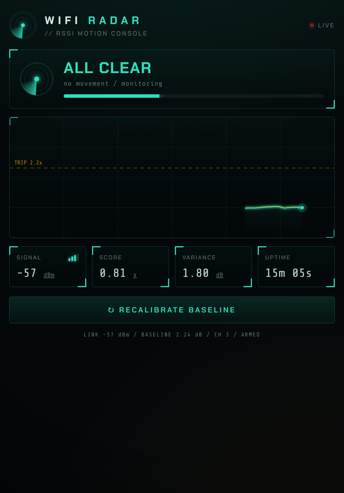

# 📡 WiFi Radar

> Motion & presence detection on a bare **ESP8266** using nothing but the **WiFi signal** — no camera, no PIR, no extra parts. Ships with a live phosphor‑radar web dashboard.

[](https://github.com/mandarwagh9/esp8266-wifi-radar/actions/workflows/build.yml)
[](LICENSE)


[](https://platformio.org/)

WiFi Radar turns a ~$2 ESP8266 into a motion sensor by watching how your body disturbs the ambient 2.4 GHz radio field. A person moving through a room scrambles the WiFi multipath, making the received signal strength (**RSSI**) jitter. The firmware learns your empty‑room baseline, then flags **motion** whenever that jitter spikes — and streams it all to a real‑time dashboard you open from your phone.



## ✨ Features

- **Zero extra hardware** — needs only an ESP8266 + USB/serial; no camera, PIR, or sensors
- **WiFi‑only sensing** — detects motion from RSSI variance against an auto‑calibrated baseline
- **Live web dashboard** — animated "signals console": phosphor scope, threshold line, motion alarm
- **Lean by design** — ~36% RAM, a 137‑byte telemetry payload, smooth 60 fps client‑side rendering
- **Onboard LED + serial meter** — glanceable status without opening a browser
- **mDNS** — reachable at `http://wifiradar.local`
- **Tunable** — sensitivity, window, and hold time are exposed as constants

## 🧠 How it works (in one paragraph)

Router→ESP WiFi travels by many reflected paths that interfere into a single RSSI value — a fingerprint of the room. A moving body changes those paths, so RSSI jitters. We sample RSSI at 20 Hz, take the standard deviation over a ~3 s window, divide it by a calibrated empty‑room baseline to get a **score**, and call **motion** when `score ≥ TRIP` (with hysteresis to avoid flicker). Full write‑up: **[docs/how-it-works.md](docs/how-it-works.md)**.

## 🧰 Hardware

| | |
|---|---|
| Board | Any ESP8266 (ESP‑12E/F, NodeMCU, Wemos D1 mini, ESP‑07, …) |
| Flash | ≥ 1 MB (4 MB recommended for OTA / filesystem headroom) |
| Programmer | Onboard USB, or an external USB‑serial adapter (FTDI / CP2102 / CH340) |
| Extras | **None** |

## 🚀 Quick start

### PlatformIO (recommended)

```bash
git clone https://github.com/mandarwagh9/esp8266-wifi-radar.git
cd esp8266-wifi-radar
cp src/secrets.example.h src/secrets.h     # then edit it with your WiFi
pio run -t upload                          # build + flash
pio device monitor                         # watch it connect
```

### Arduino IDE

1. Install the **ESP8266 board package** (Boards Manager → search "esp8266").
2. Copy `src/secrets.example.h` → `src/secrets.h` and set your WiFi.
3. Open `src/main.cpp` (or paste it into a `.ino`), select your board, and **Upload**.

On boot the board connects to your WiFi, prints its IP over serial, runs a 10‑second baseline calibration (stand still / leave the room), then starts sensing.

> 🔐 **Credentials** live in `src/secrets.h`, which is **git‑ignored** — your WiFi password never enters version control.

## 🔧 Configuration & tuning

All knobs are at the top of [`src/main.cpp`](src/main.cpp):

| Constant | Default | Meaning |
|---|---|---|
| `TRIP_FACTOR` | `2.2` | Score (× baseline) needed to **enter** MOTION. ↑ = less sensitive |
| `CLEAR_FACTOR` | `1.5` | Score it must fall below to clear |
| `WINDOW` | `64` | Live averaging window, in samples (~3.2 s) |
| `CAL_SAMPLES` | `200` | Calibration length (~10 s) |
| `MOTION_HOLD_MS` | `2000` | Minimum time held in MOTION (anti‑flicker) |
| `SAMPLE_INTERVAL_MS` | `50` | RSSI sample period (20 Hz) |

Too twitchy → raise `TRIP_FACTOR`. Misses you → lower it. Hit **Recalibrate** after moving the board.

## 📊 Dashboard & HTTP API

Open `http://wifiradar.local` (or the IP printed on serial).

| Endpoint | Method | Returns |
|---|---|---|
| `/` | GET | The dashboard (HTML/CSS/JS, served from flash) |
| `/data` | GET | Live telemetry JSON (~137 bytes) |
| `/recal` | GET | Re‑runs the baseline calibration |

`/data` example:

```json
{"rssi":-57,"std":1.96,"score":1.26,"motion":false,"calibrated":true,
 "cal":200,"calTotal":200,"baseline":1.56,"trip":2.20,"up":42,"ch":3}
```

## 🖥️ Serial output

```text
=== WiFi Radar :: RSSI motion sensing ===
Connecting to "Home".........
Connected.  IP 192.168.1.9  ch 3  RSSI -57 dBm
[cal] Done. baseline RSSI std = 1.56 dB. Watching for motion...
RSSI  -57 dBm | std 1.96 | x1.26 [########----------------------] idle
RSSI  -55 dBm | std 6.10 | x3.91 [##############################] ** MOTION **
```

## ⚠️ Limitations

- Detects **motion / presence**, not identity, count, or position — and **not** an image or pose.
- Range ≈ a room (sometimes through a wall); highly environment‑dependent.
- Needs a brief still calibration; **recalibrate** after moving the board or rearranging the room.
- More ambient WiFi traffic → better sampling. (The firmware nudges the router with tiny UDP packets to keep readings fresh.)
- This is **RSSI**‑based sensing — simpler and coarser than CSI‑based WiFi sensing (which needs an ESP32 or special NICs).

## 🗺️ Roadmap

- [ ] MQTT / Home Assistant integration
- [ ] Web‑configurable tuning (no reflash)
- [ ] OTA updates
- [ ] Optional WiFiManager captive‑portal provisioning
- [ ] ESP32 + CSI branch for breathing / fall detection

## 🤝 Contributing

PRs welcome! See **[CONTRIBUTING.md](CONTRIBUTING.md)** and the **[Code of Conduct](CODE_OF_CONDUCT.md)**. CI builds the firmware with PlatformIO on every push and PR.

## 📜 License

[MIT](LICENSE) © 2026 Mandar Wagh

## 🙌 Acknowledgements

Built on the [ESP8266 Arduino core](https://github.com/esp8266/Arduino) and [PlatformIO](https://platformio.org/). Inspired by the broader field of WiFi sensing / channel‑state‑information research.
